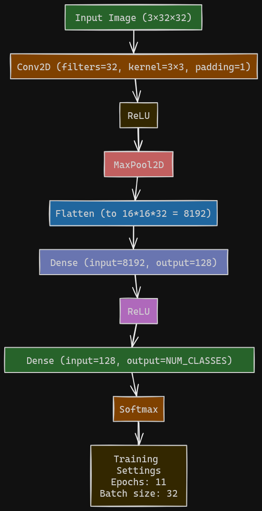

# 🚗 D3-CNN-2: Driver Distraction Detector (Simplified & Improved)

**D3-CNN-2** is a simplified version of the original D3-CNN — a Convolutional Neural Network (CNN) built **entirely from scratch using NumPy** to detect driver distractions from images and videos. Despite its simpler architecture, **D3-CNN-2 achieves significantly higher test accuracy (86%) with just 11 epochs**, compared to 78% after 40 epochs in the original.

This model is CPU-trained and features a **Streamlit frontend** for testing with image or video input.

---

## 📸 Sample Input vs Prediction

| Input Image                                                                                      | Prediction |
| ------------------------------------------------------------------------------------------------ | ---------- |
|  | `Texting`  |

---

## 🧠 Model Architecture (D3-CNN-2)

The architecture is even simpler than the original D3-CNN, yet more effective:

```python
self.layers = [
    Conv2D(filters=32, kernel_size=3, in_channels=3, padding=1),
    ReLU(),
    MaxPool2D(),
    Flatten(),
    Dense(input_size=16*16*32, output_size=128),
    ReLU(),
    Dense(input_size=128, output_size=NUM_CLASSES),
    Softmax()
]
```

### 📊 Architecture Diagram



> *Note: Please include the architecture diagram as `architecture.png` in the project root directory.*

---

## 📂 Dataset

* A mix of **publicly available data** and **self-collected images**.
* Download the dataset from this Google Drive link:
  📎 [Download Dataset](https://drive.google.com/drive/folders/1PbSZ1RF0z9Mcdn93eCshyd-z3H1v_uS4?usp=drive_link)

---

## ✅ Model Performance

* Trained on CPU from scratch
* Epochs: **11**
* Test Accuracy: **\~86%**
* Lightweight and fast-converging

---

## 🚀 Setup & Installation

### 1. Clone the repository

```bash
git clone https://github.com/AS-0167/D3-CNN.git
cd D3-CNN
```

### 2. Install dependencies

```bash
pip install -r requirements.txt
```

---

## 🧪 Running the Streamlit App

You can upload an image or a video and get distraction predictions.

```bash
streamlit run app.py
```

---

## 🏋️‍♂️ Training the Model (Optional)

To retrain the model from scratch using the dataset:

1. Ensure dependencies are installed:

   ```bash
   pip install -r requirements.txt
   ```

2. Run the training notebook:

   ```bash
   jupyter notebook train-detect-distraction.ipynb
   ```

---

## 🎓 About the Project

This project was created as a hands-on academic experiment to:

* Learn how CNNs work internally
* Understand forward and backward propagation using NumPy
* Handle dataset collection and preprocessing
* Build a mini deep learning pipeline without relying on big frameworks

No libraries like TensorFlow or PyTorch were used.

---

## 👨‍💻 Author

**\[AS-0167]**
🧑‍🎓 Student, Enthusiastic Learner of Machine Learning & Computer Vision

